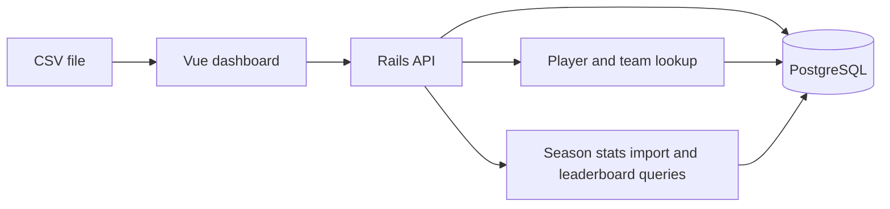

# shopify-prep-project

Player season stats explorer built with a Ruby on Rails API and a Vue 3 dashboard.

## Overview

The application imports player season stats and pitch-level tracking data from CSV files, stores the parsed data in PostgreSQL, and lets you browse the season leaderboard in the frontend.

The dashboard is designed for scouting-style workflows:

- search for players with typeahead suggestions
- filter by team, season, and category
- switch between batting, pitching, and pitch data views
- sort and paginate leaderboard rows
- import CSV files into the app and refresh the table immediately after upload
- import pitch-by-pitch CSV files through a dedicated pitch-data intake workflow

## Architecture



## Technical Changes

Recent work in the codebase added or updated the following:

- Rails models and migrations for `Team`, `Player`, `StatType`, and `PitchDatum`
- a `PlayerStat` persistence model for imported CSV rows
- CSV parsing and database writes in dedicated importer services
- API routes for player lookup, season stats import/query flows, and pitch data import/query flows
- frontend composables and dashboard UI for searching, filtering, sorting, and importing stats
- Ruby environment pinning with backend `.ruby-version` and `.ruby-gemset`
- `.gitignore` updates to keep `backend/vendor/bundle` out of source control

## Backend

Rails provides the API and persistence layer.

Notable endpoints:

- `GET /api/players` for player suggestions and lookup
- `GET /api/player_season_stats` for leaderboard data
- `POST /api/player_season_stats/import` for CSV imports
- `GET /api/pitch_data` for recently imported pitch rows
- `POST /api/pitch_data/import` for pitch CSV imports

The backend currently includes these domain models:

- `Player`
- `Team`
- `StatType`
- `PlayerStat`
- `PlayerSeasonStat`
- `PitchDatum`

## Frontend

The Vue app centers around the player season stats dashboard.

Main user-facing features:

- player typeahead search
- team and season selectors
- category switching between batting, pitching, and pitch data
- leaderboard table with sorting and pagination
- CSV import panel with upload status and summary messaging
- pitch data import drawer with upload status and summary messaging

## Setup

### Backend

```bash
cd backend
bundle install
bin/rails db:prepare
bin/rails server
```

### Frontend

```bash
cd frontend
npm install
npm run dev
```

## Reimport Player Stats

From `backend/`:

```bash
bin/rails player_stats:reimport
```

That task reseeds stat types and reruns the player stats import flow. If needed, point it at a specific CSV file:

```bash
PLAYER_STATS_CSV=/absolute/path/to/player_season_stats.csv bin/rails player_stats:reimport
```

## Import Pitch Data

From `backend/`:

```bash
bin/rails pitch_data:import
```

The task looks for these paths by default:

- `../data/mlb_pitch_data_april_2026.csv`
- `backend/data/mlb_pitch_data_april_2026.csv`

You can also provide an explicit source:

```bash
bin/rails 'pitch_data:import[/absolute/path/to/mlb_pitch_data_april_2026.csv]'
PITCH_DATA_CSV=/absolute/path/to/mlb_pitch_data_april_2026.csv bin/rails pitch_data:import
```

## Project Structure

- `backend/` Rails API, models, services, migrations, and database configuration
- `frontend/` Vue 3 app, dashboard components, and composables

## Notes

- Use the backend `.ruby-version` and `.ruby-gemset` files to match the expected Ruby environment.
- Do not commit `backend/vendor/bundle`; it is ignored by `.gitignore` and should be regenerated locally.
