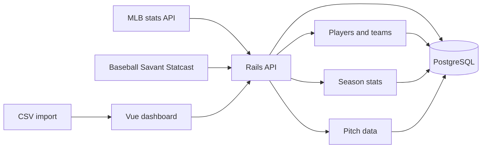

# DiamondIQ

A baseball stats explorer built with a Ruby on Rails API, PostgreSQL, and a Vue 3 dashboard.

The app imports MLB player season stats and pitch-by-pitch Statcast data, stores it locally, and exposes a filterable dashboard for leaderboards, player season history, and pitch data review.

## Current Features

- Batting and pitching leaderboards with team, player, season range, category, sorting, and pagination filters.
- Player typeahead search for leaderboard, pitcher, and batter filters.
- Shareable dashboard URLs: selected filters are written to the query string and restored on reload.
- Single-player leaderboard results sort seasons from oldest to newest.
- CSV import workflows for player season stats and pitch data.
- Direct MLB season-stat downloads for batting and pitching data.
- Direct Baseball Savant downloads for pitch-by-pitch Statcast data.
- Source-based team verification and repair for historical `player_season_stats.team_id` values.
- Admin-token protection for unsafe API requests.

## Architecture



## Tech Stack

- Backend: Rails 7.1, Ruby 3.2.3, PostgreSQL, RSpec, SeedFu
- Frontend: Vue 3, Vite, Vitest
- Data sources:
  - MLB.com stats endpoints for season-level batting and pitching totals
  - Baseball Savant Statcast CSV for pitch-level data

## Project Structure

- `backend/` Rails API, models, services, queries, rake tasks, migrations, and specs
- `frontend/` Vue dashboard, components, composables, Vite config, and tests

## Backend Setup

```bash
cd backend
bundle install
bin/rails db:prepare
bin/rails server
```

The Rails API runs on `http://127.0.0.1:3000` by default.

## Frontend Setup

```bash
cd frontend
npm install
npm run dev
```

The Vite dev server proxies `/api` requests to `http://127.0.0.1:3000`.

If the API is hosted somewhere else, set:

```bash
VITE_API_BASE_URL=http://127.0.0.1:3000 npm run dev
```

## Admin API Token

Unsafe API requests are protected when `ADMIN_API_TOKEN` is set. In production, unsafe requests fail closed unless this token is configured.

Accepted request headers:

```text
Authorization: Bearer <token>
X-Admin-Token: <token>
```

For the Vue dashboard, expose the matching value as `VITE_ADMIN_API_TOKEN` so import and download actions can send the token.

## API Endpoints

- `GET /api/players`
- `GET /api/games`
- `GET /api/games/:id`
- `GET /api/games/upcoming`
- `GET /api/schedules/:id`
- `GET /api/player_season_stats`
- `POST /api/player_season_stats/import`
- `POST /api/player_season_stats/download`
- `GET /api/pitch_data`
- `POST /api/pitch_data/import`
- `POST /api/pitch_data/download`

## Player Season Stats

Import a specific season-stat CSV:

```bash
cd backend
bin/rails 'player_stats:seed[/absolute/path/to/player_season_stats.csv]'
```

Or use an environment variable:

```bash
PLAYER_STATS_CSV=/absolute/path/to/player_season_stats.csv bin/rails player_stats:seed
```

Reseed stat types and reimport from the preferred local CSV source:

```bash
bin/rails player_stats:reimport
```

Download and import directly from MLB:

```bash
bin/rails 'player_stats:download[batting,2025,2026]'
bin/rails 'player_stats:download[pitching,1968,1968]'
```

Use `REPLACE_SEASON=1` when you want the import to delete existing rows for the downloaded season/category before inserting fresh data:

```bash
REPLACE_SEASON=1 bin/rails 'player_stats:download[pitching,1968,1968]'
```

Season-stat imports require player, team, season, category, and at least one importable stat column. The importer stores `team_id` from the source row, so historical seasons can be associated with the team the player was on for that season instead of the player record's latest team.

## Team ID Verification

Verify stored season-team assignments against MLB source data:

```bash
cd backend
bin/rails 'player_stats:verify_team_ids[pitching,1968,1968]'
```

Repair mismatched rows:

```bash
FIX=1 bin/rails 'player_stats:verify_team_ids[pitching,1968,1968]'
```

Use this source-based verifier for historical team corrections. Avoid using `player_stats:backfill_team_ids` for historical repairs, because that task fills missing values from the current `players.team_id`, which can be wrong for players who changed teams.

## Pitch Data

Import a pitch-data CSV:

```bash
cd backend
bin/rails 'pitch_data:import[/absolute/path/to/mlb_pitch_data.csv]'
```

Or use an environment variable:

```bash
PITCH_DATA_CSV=/absolute/path/to/mlb_pitch_data.csv bin/rails pitch_data:import
```

Download and import directly from Baseball Savant:

```bash
bin/rails 'pitch_data:download[2026-04-01,2026-04-07]'
```

Optional download controls:

```bash
GAME_TYPES=R CHUNK_DAYS=7 bin/rails 'pitch_data:download[2026-04-01,2026-04-30]'
```

Statcast pitch data is available from 2008 onward. The downloader chunks larger date ranges to keep requests manageable.

## Games and Schedules

Download and idempotently synchronize canonical games from the MLB Stats API:

```bash
cd backend
bin/rails 'mlb_schedule:sync[2026-04-01,2026-04-07]'
```

Optional controls:

```bash
GAME_TYPES=R SPORT_ID=1 bin/rails 'mlb_schedule:sync[2026-04-01,2026-04-30]'
```

The synchronization preserves the raw MLB schedule and game payloads, resolves teams and available probable pitchers, and updates existing games by MLB game id without creating duplicates.

## Tests

Backend:

```bash
cd backend
bundle exec rspec
```

Frontend:

```bash
cd frontend
npm run test:run
```

Frontend production build:

```bash
cd frontend
npm run build
```

## Notes

- Use `backend/.ruby-version` to match the expected Ruby version.
- Do not commit local editor settings or dependency installs such as `backend/vendor/bundle`.
- Root `.gitignore` ignores `.vscode/` so local VS Code settings stay out of the repository.
