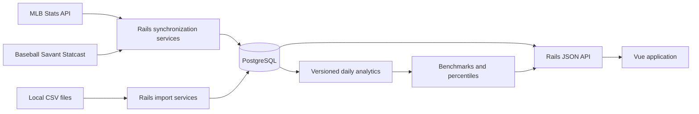

# DiamondIQ

DiamondIQ is a local-first baseball intelligence application built with a Ruby on Rails API, PostgreSQL, and a Vue 3 frontend. It downloads and normalizes MLB schedules, rosters, profiles, box scores, season statistics, and Statcast pitches, then turns those sources into searchable player and team profiles, leaderboards, game drill-downs, rolling trends, and contextual benchmarks.

## Current Features

### Stat Board

- Batting and pitching leaderboards with season, team, player, category, sorting, and pagination controls.
- A sortable season column and shareable filter state stored in the URL.
- Player name autocomplete and robust player search that links directly to profiles.
- A separate pitch-data mode so large Statcast queries are loaded only when requested.

### Player Profiles

- MLB biography, handedness, primary and secondary positions, jersey number, headshot, and current roster status.
- Current and historical team memberships with source and freshness information.
- Career batting or pitching table with one row per season and a career-total row.
- Recent batter and pitcher Statcast indicators.
- Full-season, trailing 7-, 14-, and 30-day, and custom date-range analysis.
- Equal-length previous-period comparisons.
- Selectable rolling windows of 25, 50, or 100 plate appearances and 50, 100, or 250 pitches.
- Trend charts for exit velocity, hard-hit rate, pitch velocity, pitch usage, whiff rate, and chase rate.
- MLB, position, and pitcher-role averages; player percentiles; period-over-period changes; and sample sizes.

### Team Profiles

- MLB team directory with logos and dedicated team pages.
- Season record, runs scored and allowed, recent results, and upcoming games.
- Current 40-man and active roster views with links to player profiles.
- Roster, schedule, and synchronization freshness metadata.

### Games and Schedules

- Idempotent MLB schedule synchronization with canonical games, teams, venues, probable pitchers, raw responses, and synchronization timestamps.
- Filters for team, date range, season, status, and game type.
- Box-score and live-feed synchronization for batting lines, pitching lines, lineups, substitutions, and plate appearances.
- Statcast pitch linkage by MLB game and at-bat identifiers.
- Game detail responses supporting the drill-down from game to player line to plate appearance to pitch.
- Support for incomplete, postponed, suspended, and doubleheader schedule data.

### Rosters and Profiles

- MLB player-profile synchronization for biographies, handedness, positions, and headshots.
- 40-man roster synchronization for all MLB teams, either league, or one team.
- Historical `TeamMembership` records as the roster source of truth, with normalized roster and injured-list states.
- Independent dated snapshots of both active and 40-man rosters without modifying membership history.

### Derived Analytics

- Incrementally refreshed, calculation-versioned daily summaries for player batting, player pitching, pitcher pitch type, batter splits, pitcher splits, and team metrics.
- Cached contextual MLB, position, and pitcher-role benchmarks.
- Player percentiles, sample sizes, prior-period values, and changes.
- Read-only benchmark calculation for uncached custom player date ranges.

### Data Administration

The `/admin` page centralizes the application's data operations:

- Download and import player season statistics and Statcast pitches.
- Synchronize MLB schedules, game details, player profiles, and 40-man rosters.
- Track game-detail progress in real time, recover active progress after a page reload, and cancel safely between games.
- Capture dated active and 40-man roster snapshots.
- Rebuild normalized current player positions.
- Inspect currently stored date or season coverage for each major dataset.
- View the current environment's PostgreSQL size, largest tables, data/index footprints, estimated live and dead rows, server version, and measurement time.

## Architecture



## Tech Stack

- Backend: Ruby 3.2.3, Rails 7.1, PostgreSQL, Solid Queue, RSpec, and SeedFu
- Frontend: Vue 3, Vue Router, Vite, and Vitest
- Sources:
  - MLB Stats API for schedules, games, box scores, live feeds, teams, rosters, profiles, and season statistics
  - Baseball Savant for Statcast pitch-by-pitch data

## Project Structure

- `backend/` — Rails API, data models, synchronization/import services, queries, jobs, Rake tasks, migrations, and specs
- `frontend/` — Vue routes, views, components, composables, styles, and tests
- `docs/` — project requirements and expansion plans

## Local Setup

Prerequisites: Ruby 3.2.3, PostgreSQL, and Node.js 20.19+ (or 22.12+).

### Backend

```bash
cd backend
bundle install
bin/rails db:prepare
bin/rails server
```

The Rails API runs at `http://127.0.0.1:3000` by default. Use `backend/.ruby-version` to select the expected Ruby version.
In development, Puma also starts the Solid Queue worker used by tracked Admin tasks.

For production, run the durable job worker as a separate process:

```bash
cd backend
bin/jobs start
```

Alternatively, set `SOLID_QUEUE_IN_PUMA=1` to run it with Puma.

### Frontend

In a second terminal:

```bash
cd frontend
npm install
npm run dev
```

The Vite development server proxies `/api` requests to `http://127.0.0.1:3000`. To use a different API origin:

```bash
VITE_API_BASE_URL=http://127.0.0.1:3000 npm run dev
```

The main frontend routes are:

- `/` — Player Season Stat Board
- `/players/:id` — unified player profile
- `/teams` — MLB team directory
- `/teams/:id` — team profile
- `/admin` — imports, synchronization, analytics, and database information

## Recommended Data Workflow

Source imports and MLB synchronization are available from the Admin page. The complete command-line workflow, including derived analytics, is:

1. Synchronize schedules and canonical games.
2. Synchronize game details and plate appearances.
3. Download season statistics and Statcast pitches.
4. Synchronize 40-man rosters and player profiles.
5. Refresh daily analytics and contextual benchmarks.

All synchronization tasks are designed to be repeatable and idempotent.

### Schedules

```bash
cd backend
bin/rails 'mlb_schedule:sync[2026-04-01,2026-04-30]'
```

Optional controls:

```bash
GAME_TYPES=R SPORT_ID=1 bin/rails 'mlb_schedule:sync[2026-04-01,2026-04-30]'
```

### Game Details

Synchronize stored games within a date range:

```bash
bin/rails 'mlb_game_details:sync[2026-04-01,2026-04-07]'
```

Or refresh one game by its MLB game id:

```bash
MLB_GAME_ID=823443 bin/rails mlb_game_details:sync
```

### Player Season Statistics

Download and import batting or pitching statistics:

```bash
bin/rails 'player_stats:download[batting,2025,2026]'
bin/rails 'player_stats:download[pitching,2025,2026]'
```

Replace existing rows for each requested season and category:

```bash
REPLACE_SEASON=1 bin/rails 'player_stats:download[batting,2025,2026]'
```

Import a local CSV:

```bash
bin/rails 'player_stats:seed[/absolute/path/to/player_season_stats.csv]'
# or
PLAYER_STATS_CSV=/absolute/path/to/player_season_stats.csv bin/rails player_stats:seed
```

Reseed stat types and reimport the preferred local CSV:

```bash
bin/rails player_stats:reimport
```

Verify or repair historical team assignments against MLB source data:

```bash
bin/rails 'player_stats:verify_team_ids[pitching,1968,1968]'
FIX=1 bin/rails 'player_stats:verify_team_ids[pitching,1968,1968]'
```

### Statcast Pitch Data

Download and import from Baseball Savant:

```bash
bin/rails 'pitch_data:download[2026-04-01,2026-04-07]'
```

Optional controls:

```bash
GAME_TYPES=R CHUNK_DAYS=7 bin/rails 'pitch_data:download[2026-04-01,2026-04-30]'
```

Import a local CSV:

```bash
bin/rails 'pitch_data:import[/absolute/path/to/mlb_pitch_data.csv]'
# or
PITCH_DATA_CSV=/absolute/path/to/mlb_pitch_data.csv bin/rails pitch_data:import
```

Statcast pitch data is available from 2008 onward. Large ranges are downloaded in chunks. Imported pitches are linked to canonical games by `game_pk` and to plate appearances when matching game and at-bat data exists.

### Rosters and Player Profiles

Synchronize a team's normal 40-man roster through the end of a past season or through today for the current season:

```bash
bin/rails 'mlb_roster:sync[116,2026]'
```

Capture independent active and 40-man snapshots for a particular date:

```bash
bin/rails 'mlb_roster_snapshots:sync[116,2026-07-15]'
```

Synchronize missing player profiles:

```bash
bin/rails mlb_player_profiles:sync
```

Useful profile controls:

```bash
ONLY_MISSING=false BATCH_SIZE=50 LIMIT=100 bin/rails mlb_player_profiles:sync
MLB_IDS=592450,680776 bin/rails mlb_player_profiles:sync
```

### Daily Analytics and Context

Refresh derived daily summaries after importing game or pitch data:

```bash
bin/rails 'daily_analytics:refresh[2026-04-01,2026-04-30]'
```

Refresh cached benchmarks and player percentiles:

```bash
bin/rails 'contextual_benchmarks:refresh[2026-04-01,2026-04-30]'
```

Set `VERSION` to calculate a separate analytics version:

```bash
VERSION=1.1.0 bin/rails 'daily_analytics:refresh[2026-04-01,2026-04-30]'
```

## API Overview

### Players and Teams

- `GET /api/players` — searchable, paginated player directory data
- `GET /api/players/:id` — unified profile, career history, roster history, analysis, trends, and benchmarks
- `GET /api/teams`
- `GET /api/teams/:id` — team profile, record, games, and active/40-man rosters
- `GET /api/positions`

Player analysis parameters include `range=season|7|14|30|custom`, `start_date`, `end_date`, `pa_window`, and `pitch_window`.

### Games, Schedules, and Rosters

- `GET /api/games`
- `GET /api/games/:id`
- `GET /api/games/upcoming`
- `GET /api/schedules/:id`
- `GET /api/roster_snapshots`
- `GET /api/team_memberships/active_today`
- `GET /api/team_memberships/active_range`
- `GET /api/team_memberships/roster_status`

Game filters include team, start/end date, season, status, and game type. Collection endpoints support pagination where applicable.

### Statistics and Imports

- `GET /api/player_season_stats`
- `POST /api/player_season_stats/import`
- `POST /api/player_season_stats/download`
- `GET /api/pitch_data`
- `POST /api/pitch_data/import`
- `POST /api/pitch_data/download`

### Admin Tasks

- `GET /api/admin/tasks` — task catalog plus dataset coverage and database metrics
- `POST /api/admin/tasks/:task_name/run` — run an allowed synchronization or analytics task

## Admin API Token

Unsafe API requests are protected when `ADMIN_API_TOKEN` is set. In production, unsafe requests fail closed unless this token is configured.

Accepted request headers:

```text
Authorization: Bearer <token>
X-Admin-Token: <token>
```

Set the matching frontend value as `VITE_ADMIN_API_TOKEN` so Admin page imports, downloads, and tasks can authenticate:

```bash
ADMIN_API_TOKEN=your-local-token bin/rails server
VITE_ADMIN_API_TOKEN=your-local-token npm run dev
```

## Tests

Backend:

```bash
cd backend
bundle exec rspec
```

Frontend:

```bash
cd frontend
npm run test:run
```

Production frontend build:

```bash
cd frontend
npm run build
```

## Data Model Notes

- `TeamMembership` is the historical source of truth for a player's team and roster status over time.
- `RosterSnapshot` preserves a source roster exactly as observed on a date and does not replace membership history.
- `players.team_id` represents the current team cache and should agree with the active membership when one exists.
- `games.mlb_id` and `pitch_data.game_pk` identify the same MLB game; `pitch_data.game_id` provides the canonical database relationship.
- Raw upstream responses, source names or URLs, and synchronization timestamps are retained by synchronization models where available.
